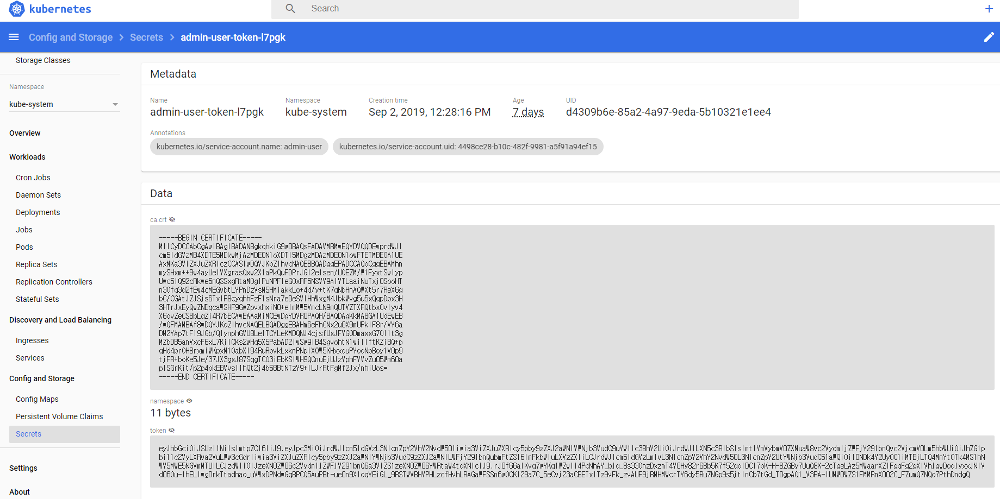
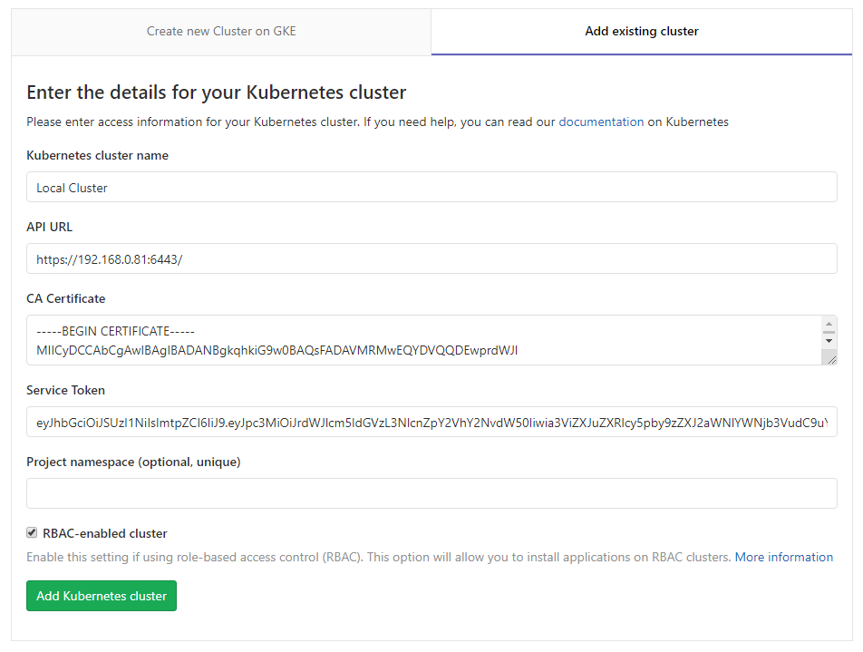
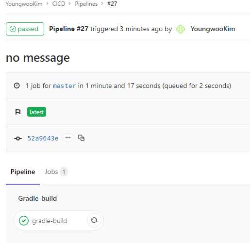
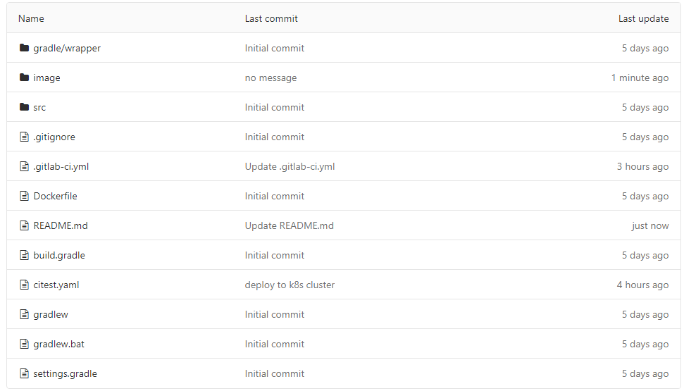
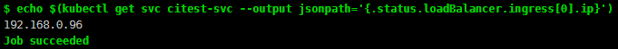

# GitLab CI를 통해 k8s에 서비스 배포하기
Gitlab에서 제공하는 CI/CD 기능을 통해 소스 커밋시점에 배포까지 자동화하기
1. GitLab CI/CD 설정하기
	1. Kubernetes Cluster 연동하기
	2. GitLab Runner 생성하기
2. 빌드 자동화 하기
	1.  Gradle 빌드 자동화
	2. Docker Build 자동화
3. 배포 자동화 하기
	1. Kubernetes Cluster에 서비스 배포하기
	2. 서비스 오브젝트 추가하기

# 예제 환경
GitLab Comunity Edition v11.10.4
>Address : http://192.168.0.41

Kubernetes v1.15.3
>Kubernetes master : https://192.168.0.81:6443

>DashBoard Address : http://192.168.0.90

Nexus Repository3 v3.14.0

>Address : https://192.168.0.41:8081

>Docker registry : http://192.168.0.41:4567

# GitLab CI/CD 설정하기

GitLab에서 CI/CD 기능을 사용하기 위해서는 Gitlab Runner라는 인스턴스가 필요하다.

GitLab에서는 다양한 Runner를 지원하는데 우리는 그중에서 Kubernetes에 Docker Container 형태로 제공되는 Runner를 사용 할 예정이다.

Kubernetes Cluster를 GitLab 프로젝트에 연동하고 Runner를 생성해보자.

## Kubernetes Cluster 연동하기

1. 프로젝트 왼쪽 메뉴에서 **Operation > Kubernetes** 메뉴에서 **Add Kubernetes Cluster** 를 클릭한다.
2. **Add existing cluster** 탭을 선택하여 기존에 보유하고있는 Kubernetes Cluster를 등록한다.
3. **Kubernetes cluster name** 에 인지하기 쉬운 클러스터 명을 입력한다.
4. **API URL** 에 **Kubernetes master** 주소를 입력한다.
	>이 예제에서 사용된 마스터의 주소는 `https://192.168.0.81:6443` 이다.
  
	>Kubernetes master 주소는 `kubectl cluster-info` 명령을 통해 확인할 수 있다.
5. **CA Certificate** 에는 부여받은 계정에 CA 인증서를 입력한다.
6. **Service Token** 에는 부여받은 계정에 Service Token을 입력한다
7. 계정에 Token과 CA 인증서는 Dashboard에서 확인 가능하다.




## GitLab  Runner  생성하기
Kubernetes Cluster 등록이 완료되고 전환된 화면에서 **GitLab Runner**를 설치할 것이다.

GitLab은 GitLab Runner를 원격 kubernetes에 설치하기 위해 **Helm**을 사용한다.

초기에는 Helm이 설치되어있지 않아 GitLab Runner에 Install 버튼이 비활성화되어 있을 것이다.

1. **Helm**을 Install 버튼을 눌러 설치한다.
2. **GitLab Runner**를 Install 버튼을 눌러 설치한다.
3. 프로젝트 메뉴에서 **Settings > CI/CD > Runners**메뉴에 **Runners activated  for this project** 항목에서 Runner가 정상적으로 등록되었는지 확인하다.
# 빌드 자동화 하기
Runner 생성이 완료되면 **Pipe Line**에 **Job**을 등록할 수 있다.
>그 전까지는 실제 작업이 가능한 Runner가 없어서 실패할것이다.
>
Job을 등록하는 방법은 `.gitlab-ci.yml`문서에 기록하면 된다.

이번 장에서는 어플리케이션을 자동으로 빌드하고 Docker Image로 만드는것이 목표이다.

`.gitlab-ci.yml`문서에 **gradle build**와 **docker build**를 추가 해보자.
## Gradle  빌드  자동화
아래와 같이 `.gitlab-ci.yml` 문서를 작성해보자

	image: docker:18.09 #베이스 이미지 버전
	
	before_script: #Job 실행 전 우선 실행 스크립트
	  - export #gitlab CI/CD에 설정된 환경변수를 가져온다.
	stages: 
	  - gradle-build #Job의 순서

	gradle-build: 
	  image: gradle:alpine 
	  stage: gradle-build
	  variables: 
	    GRADLE_OPTS: "-Dorg.gradle.daemon=false" 
	  before_script: 
	    - export GRADLE_USER_HOME=`pwd`/.gradle 
	  script: 
	    - gradle build 
	  cache: 
	    key: "$CI_COMMIT_REF_NAME" #Cache Key를 Brunch명을 사용
	    paths: #Cache할 대상들 
	      - build 
	      - .gradle 
	  artifacts: #다음 Job으로 전달할 파일 또는 디렉토리
	    paths: 
	      - build/libs/*.jar
 위 내용을 작성하고 Commit 하면 자동으로 프로젝트를 빌드하게 된다.
 
 
## Docker  Build  자동화
Gradle Build가 끝나면 완성된 Jar 파일을 Docker Image 형태로 만들어보자.

우선 Docker Image를 Build 하기 위해서는 아래와 같은 **Dockerfile**이 필요하다.

    FROM openjdk:8-jre-alpine 
    VOLUME /tmp 
    ADD /build/libs/*.jar app.jar 
    ENTRYPOINT ["sh", "-c", "java -Djava.security.egd=file:/dev/./urandom -Duser.country=KR -Duser.language=ko -Duser.timezone=Asia/Seoul -jar /app.jar"]

이제  ``.gitlab-ci.yml``파일에서 **stages** 부분에 Docker Build 를 추가해보자 

    stages:
      - gradle-build
      - docker-build #docker-build 추가

도커 빌드 환경을 사용하기 위해서는 몇가지 추가적인 설정이 필요하다.

    services:
      - name: docker:18.09-dind
        command: ["--insecure-registry=192.168.0.41:4567"]
      
    variables:
      DOCKER_HOST: tcp://localhost:2375

이제 docker-build stage에서 해야 할 작업을 정의해보자	

아래의 코드는 도커 빌드과 완성된 도커이미지를 nexus repository에 `push`하는 코드이다.

    docker-build: 
      stage: docker-build
      script: 
        - docker login -u admin -p admin123 $CI_REGISTRY 
        - docker build -t $CI_REGISTRY_IMAGE:$CI_PIPELINE_ID . 
        - docker tag $CI_REGISTRY_IMAGE:$CI_PIPELINE_ID $CI_REGISTRY_IMAGE:latest
        - docker push $CI_REGISTRY_IMAGE:$CI_PIPELINE_ID
        - docker push $CI_REGISTRY_IMAGE:latest
before_script의 export 명령의 통해 우리는 다양한 환경변수를 기본으로 가지고있다.

`$CI_REGISTRY`는 우리가 사용하는 nexus repository의 주소이다.

`$CI_REGISTRY_IMAGE`는 nexus repository에서 해당 프로젝트가 사용할 디렉토리 경로인다.

> 보통 레포지토리 주소/계정명/프로젝트명 으로 이루어져있다.

> ex) 192.168.0.41:4567/ywkim/citest

`$CI_PIPELINE_ID`는 각 파이프 라인의 번호를 가지고있다.

파일 위치는 아래 사진을 참고



# 배포  자동화  하기
어플리케이션의 빌드가 모두 완료되었다면 운영중인 Kubernetes 환경에 완성된 Docker Image를 배포해보자

## Kubernetes  Cluster에 서비스 배포하기
쿠버네티스 환경에서 다양한 Controller를 사용해서 App을 배포할 수 있다.
이 예제에서는 Deployment를 사용해서 배포해보자
### Deployment 오브젝트 스펙 준비하기
Deployment 배포에 필요한 yaml 문서는 아래와 같다.

`citest.yaml`

    apiVersion: apps/v1
    kind: Deployment #정의할 오브젝트의 종류
    metadata:
      name: citest #별칭
      labels:
        app: citest #라벨
    spec:
      replicas: 3 #복제본 수
      selector:
        matchLabels:
          app: citest #관리할 Pod의 검색조건
      template:
        metadata:
          labels:
            app: citest #생성할 Pod의 라벨
        spec:
          containers: 
          - name: citest #생성할 Pod의 이름
            image: 192.168.0.41:4567/ywkim/citest:latest #Pod 생성시 사용할 Image
            ports:
            - containerPort: 8080 #Pod의 포트 사용정보

### .gitlab-ci.yml에 Kubernetes 배포 추가하기
배포에 사용할 오브젝트 스펙의 정의가 끝났다.

이제 배포 파이프라인에 관련 Job을 추가해야한다.

 `.gitlab-ci.yml`파일에서  **stages**  부분에 kubernetes-deploy 를 추가해보자
```
stages:
  - gradle-build
  - docker-build
  - kubernetes-deploy #쿠버네티스 배포 작업 추가
```
해당 스테이지에서 실제로 해야하는 작업을 정의하자.
```
kubernetes-deploy:
  image: lwolf/kubectl_deployer
  stage: kubernetes-deploy
  script: 
    - kubectl describe namespace "$KUBE_NAMESPACE" || kubectl create namespace "$KUBE_NAMESPACE"
    - export DEPLOYS=$(kubectl get deployments | grep citest | wc -l)
    - if [ ${DEPLOYS}  -eq 0 ]; then kubectl apply -f citest.yaml; else kubectl --record deployment.apps/citest set image deployment.v1.apps/citest citest=$CI_REGISTRY_IMAGE:$CI_PIPELINE_ID; fi
  dependencies: []
```
script 하위에 내용이 생소하니 한줄씩 확인해보자

`kubectl describe namespace "$KUBE_NAMESPACE" || kubectl create namespace "$KUBE_NAMESPACE"`

이 부분은 kubectl 명령을 통해 네임스페이스가 존재하지 않으면 생성하는 부분이다.

여기서 사용된 **\$KUBE_NAMESPACE**는 깃랩과 쿠버네티스 연동시 생성된 쿠버네티스 네임스페이스명을 담고있다.

`export DEPLOYS=$(kubectl get deployments | grep citest | wc -l)`

이 부분은 해당 네임스페이스에 같은 이름의 Deployment가 존재하는지 확인하는 부분이다.

``grep citest`` 부분에서 **citest**는 **deployment.yaml**에서 정의한 object에 name이므로 상황에 따라 변경해야한다.

`if [ ${DEPLOYS} -eq 0 ]; then kubectl apply -f citest.yaml; else kubectl --record deployment.apps/citest set image deployment.v1.apps/citest citest=$CI_REGISTRY_IMAGE:$CI_PIPELINE_ID; fi`

이부분은 조금 길어서 3번의 나눠서 확인해보자

`if [ ${DEPLOYS} -eq 0 ]` 

우선 이부분은 앞에서 확인한 Deployment 존재여부를 체크한다.
DEPLOYS가 0인지 확인한다.

>Deployment가 존재하지 않으면 DEPLOYS는 0을 가지고있다.
>
`then kubectl apply -f citest.yaml`

이 부분은 DEPLOYS가 0일때 작동한다.

우리가 작성해둔 `citest.yaml`파일을 쿠버네티스 클러스터에 배포한다.

`else kubectl --record deployment.apps/citest set image deployment.v1.apps/citest citest=$CI_REGISTRY_IMAGE:$CI_PIPELINE_ID`

이 부분은 DEPLOYS가 1일때 작동한다.

동일한 이름의 Deployment가 존재하므로 이미지 버전만을 업데이트한다.
## 서비스 오브젝트 추가하기
어플리케이션을 배포해도 서비스 오브젝트가 없다면 웹 어플리케이션등은 확인이 어려워진다.
외부에서 웹으로 접속 가능하게 하기위하여 서비스 오브젝트를 추가해보자.
### Service 오브젝트 스펙 준비하기
서비스 오브젝트 배포에 앞서 오브젝트 스펙을 정의해보자
`citest-svc.yaml` 이라는 이름의 파일을 아래와 같이 작성해보자

    apiVersion: v1
    kind: Service
    metadata:
      name: citest-svc
      labels:
      app: citest
    spec:
      ports:
      - port: 80
        protocol: TCP
        targetPort: 8080
      selector:
        app: citest
      type: LoadBalancer

### .gitlab-ci.yml에 추가하기

`.gitlab-ci.yml` 파일에 kubernetes-deploy 부분을 아래와 같이 수정한다.


```
kubernetes-deploy:
  image: lwolf/kubectl_deployer
  stage: kubernetes-deploy
  script: 
    - kubectl describe namespace "$CI_PROJECT_PATH_SLUG" || kubectl create namespace "$CI_PROJECT_PATH_SLUG"
    - export DEPLOYS=$(kubectl get deployments | grep citest | wc -l)
    - if [ ${DEPLOYS}  -eq 0 ]; then kubectl apply -f citest.yaml; else kubectl --record deployment.apps/citest set image deployment.v1.apps/citest citest=$CI_REGISTRY_IMAGE:$CI_PIPELINE_ID; fi
    - kubectl apply -f citest-svc.yaml
    - echo $(kubectl get svc citest-svc --output jsonpath='{.status.loadBalancer.ingress[0].ip}')
  dependencies: []
  environment: 
    name: test
 ```
 
 서비스 등록을 위해 **script** 부분에 아래 두줄이 추가되었다.
 
 `kubectl apply -f citest-svc.yaml`은 우리가 작성한 서비스 스펙을 등록한다.
 
` echo $(kubectl get svc citest-svc --output jsonpath='{.status.loadBalancer.ingress[0].ip}')`은 등록된 서비스에 외부 아이피를 화면에 출력한다.

Job이 완료되면 해당 Job에 터미널에서 서비스의 아이피를 다음과 같이 확인할 수 있다.


